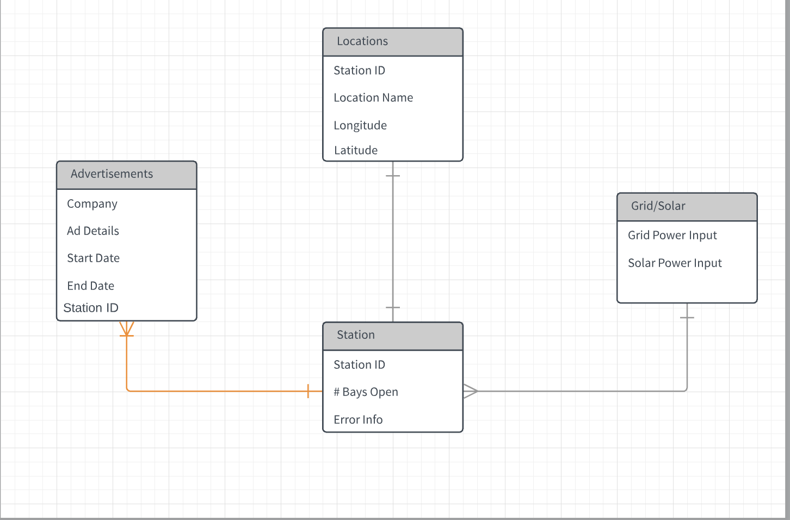

**Solar Scooter Chargers**

**1.1 – Project Description**

We will use a **key-value store type database.** Graph and document databases seem unnecessary because we do not need to connect each individual station in any way, and we do not need to store actual documents like jstor. Examples include: [InfinityDB](https://boilerbay.com/infinitydb/), [Oracle NoSQL](http://www.oracle.com/technetwork/database/database-technologies/nosqldb/overview/index.html), and [Redis](https://redis.io/documentation). We will have to do some further research to figure out which database will be easiest to incorporate with our app and AWS.

Potential users include our team, whatever electric scooter companies we partner with, and station users.

We will be implementing this database for our CMSI 401 Software Engineering project, but due to cross-team dependencies, we will not be able to fully solidify what data we need by the deadline of this project, so we will be implementing &quot;dummy data&quot; for this semester assignment to be used as placeholders for future data..

**1.2 – Data description**

Generally, the type of data the database will store will include: Locations, Advertisement information (who the ad is from, information about ad content, dates it runs for, etc.), grid and solar information, and scooter/bike information (ie. number of open bays)

**1.3 – Data Type Examples**

- **Locations** - Once we scale up, longitude and latitude or GPS location information will allow for easy tracking of stations
- **Grid/solar info** - To track whether we are using 100% solar power on sunny days or grid power on cloudy days, and how much solar power is being created
- **Bay availability** - This will allow us to give the users of the station a number of open bays in each station.
- **Advertisements** - Since we intend to advertise in the future, we will include data related to the advertisements running on each of the stations, the company that purchased the ad, how long the add is to be run for, and which station(s) it is running at
- **Station use history** - For us to have data about which stations are being used and at what times, could be used later to place ads
- **Station maintenance data** - This data will possibly include a flag that lets us know whether there are any errors of maintenance that needs to be performed on a specific station location.

**1.4 – Preliminary Schema**

- Locations

| Station ID | Location Name? | Longitude | Latitude | Part IDs |
| --- | --- | --- | --- | --- |
| Unique ID that can be used as the primary key... might want to generate randomly for security reasons | Descriptive name of where the station is located (e.g. Lincoln and Manchester Station, Manhattan Beach Pier Station) | The geographical longitude of the stations location | The geographical latitude of the stations location | IDs of the solar panels which are associated with this station |

- Advertisement info (who the ad is from, info about ad content, dates it runs for, etc.)

| Ad ID | Company | Start date | End date | Station IDs |
| --- | --- | --- | --- | --- |
| Randomly generated unique ID | The company whom the ad belongs to | Day that the ad starts showing | Day that the ad ends showing | The stations which this particular ad will be displaying at |

- Grid/solar info

| Station ID | Daily grid Input | Solar input | Solar efficiency |
| --- | --- | --- | --- |
| Randomly generated unique ID | The amount of power drawn from the grid to a particular station on each day | The amount of solar drawn from the grid to a particular station on each day | The total efficiency that the solar panels within a station are combining to work at |

- Station info - open bays etc.

| Station ID | Open bays | Error info? |
| --- | --- | --- |
| Randomly generated unique ID | The bays that are available within each station | Fault detection that helps us determine when a station needs to be brought offline |

- Bays

| Bay ID | Bay available | Scooter ID |
| --- | --- | --- |
| Randomly generated unique ID | A simple true / false that indicates whether a scooter can be placed in that bay | The ID of the scooter that is currently parked in a bay (if there is one) |

- Parts - every single part that is being used in a station

| Part ID | Part Number | Description | Station IDs | Purchase Date | Cost |
| --- | --- | --- | --- | --- | --- |
| Randomly generated unique ID | The official part number | What the part does / what it is for | The station each part is associated with | When the part was purchased | The cost of the part |

**1.5 – Preliminary Entity-Relationship Diagram**

